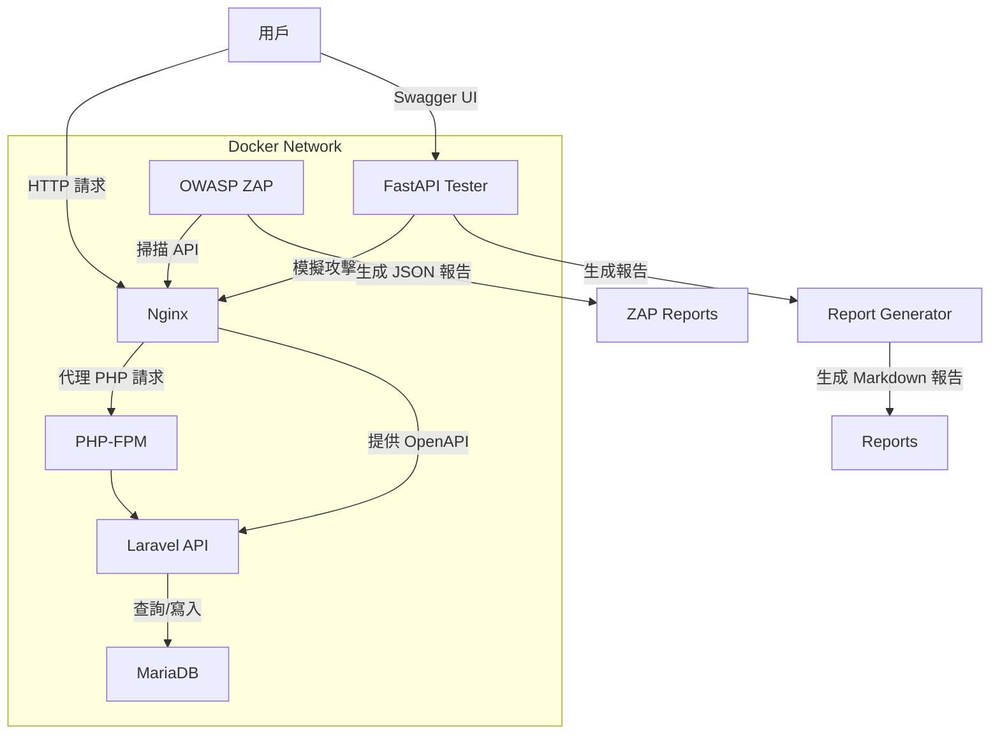

# OWASP Hardened API Suite

這是一個簡潔的 DevSecOps 範例專案，展示如何使用 Laravel API 和 FastAPI 測試器來模擬安全測試環境。專案僅包含核心代碼（Laravel 控制器、FastAPI 攻擊模擬器等），適合有經驗的開發者將其整合到現有的 Laravel 或 FastAPI 專案中，進行 API 安全測試。我們希望提供一個實用的基礎，讓您能快速驗證 XSS、SQL 注入等防禦邏輯。

> **注意**：本倉庫只包含核心代碼，**不包含**完整的 Laravel 框架結構或 `create_project.sh` 腳本。請自行設置 Laravel 應用和 Docker 環境。

## 專案目標
- 提供安全的 Laravel API 範例，支援 Sanctum 認證。
- 使用 FastAPI 模擬 SQL 注入、XSS 和認證漏洞攻擊。
- 支援 OWASP ZAP 動態安全掃描（需自行配置）。
- 生成簡單的 Markdown 安全報告（需整合報告生成腳本）。

## 系統架構
以下是預期的系統架構，需自行設置環境以符合此結構：



- **Nginx**：處理 HTTP 請求，代理到 PHP-FPM 或 FastAPI（需自行配置）。
- **Laravel API**：核心代碼提供產品查詢與評論功能，防禦 XSS 和 SQL 注入。
- **MariaDB**：儲存資料，需自行設置遷移與種子數據。
- **FastAPI Tester**：模擬攻擊並執行 Pytest 測試，驗證 API 安全性。
- **OWASP ZAP**：執行動態安全掃描，需自行設置。
- **Report Generator**：生成報告，需整合 `generate_report.py`。

## 先決條件
- **Docker** 和 **Docker Compose**：用於容器化環境。
- **PHP 8.2+** 和 **Composer**：用於 Laravel 環境。
- **Python 3.9+** 和 **pip**：用於 FastAPI 測試器。
- **Node.js**（可選）：用於額外工具或測試。
- 硬體：建議 4GB RAM 和 10GB 磁碟空間。

## 安裝與使用
由於本倉庫僅包含核心代碼，您需要自行設置 Laravel 和 FastAPI 環境。以下是建議步驟：

1. **Clone 倉庫**：
   ```bash
   git clone https://github.com/BpsEason/owasp-hardened-api-suite.git
   cd owasp-hardened-api-suite
   ```

2. **設置 Laravel 環境**：
   - 初始化一個新的 Laravel 專案：
     ```bash
     composer create-project laravel/laravel laravel-app
     ```
   - 將倉庫中的 `laravel-app/app/Http/Controllers/ProductController.php` 和其他核心檔案複製到 `laravel-app` 的對應目錄。
   - 安裝 Laravel Sanctum：
     ```bash
     cd laravel-app
     composer require laravel/sanctum
     php artisan vendor:publish --provider="Laravel\Sanctum\SanctumServiceProvider"
     ```
   - 配置 `.env` 文件，設置資料庫連線（例如 MariaDB）：
     ```env
     DB_CONNECTION=mysql
     DB_HOST=127.0.0.1
     DB_PORT=3306
     DB_DATABASE=laravel_db
     DB_USERNAME=user
     DB_PASSWORD=password
     ```
   - 創建資料庫遷移與種子檔案（可參考 Laravel 文件自行撰寫）。

3. **設置 FastAPI 環境**：
   - 將倉庫中的 `fastapi-tester/` 目錄複製到您的專案。
   - 安裝 Python 依賴：
     ```bash
     cd fastapi-tester
     pip install -r requirements.txt
     ```
   - 啟動 FastAPI 服務：
     ```bash
     uvicorn app.main:app --host 0.0.0.0 --port 8001
     ```

4. **設置 Docker 環境（可選）**：
   - 自行創建 `docker-compose.yml`，參考以下範例：
     ```yaml
     version: '3.8'
     services:
       nginx:
         image: nginx:latest
         ports:
           - "8000:80"
         volumes:
           - ./laravel-app:/var/www/html
           - ./nginx/default.conf:/etc/nginx/conf.d/default.conf
         depends_on:
           - php
           - mariadb
         networks:
           - app-network
       php:
         image: php:8.2-fpm
         volumes:
           - ./laravel-app:/var/www/html
         networks:
           - app-network
       mariadb:
         image: mariadb:10.6
         environment:
           - MARIADB_ROOT_PASSWORD=root_password
           - MARIADB_DATABASE=laravel_db
           - MARIADB_USER=user
           - MARIADB_PASSWORD=password
         networks:
           - app-network
       fastapi-tester:
         image: python:3.9-slim
         volumes:
           - ./fastapi-tester:/app
         ports:
           - "8001:8001"
         command: ["uvicorn", "app.main:app", "--host", "0.0.0.0", "--port", "8001"]
         networks:
           - app-network
     networks:
       app-network:
         driver: bridge
     ```
   - 配置 Nginx（創建 `nginx/default.conf`）和 PHP-FPM（參考 Laravel 文件）。

5. **運行安全測試**：
   - 運行 Laravel PHPUnit 測試（需自行設置測試檔案）：
     ```bash
     cd laravel-app
     ./vendor/bin/phpunit
     ```
   - 運行 FastAPI Pytest 測試：
     ```bash
     cd fastapi-tester
     pytest tests/test_security.py
     ```
   - 運行 OWASP ZAP 掃描（需自行設置）：
     ```bash
     docker run --rm -v $(pwd)/zap-reports:/zap/wrk:rw owasp/zap2docker-stable \
       zap-cli --port 8080 --host 127.0.0.1 -v \
       openapi http://localhost:8000/api/openapi.json \
       spider http://localhost:8000/api \
       active_scan http://localhost:8000/api \
       report /zap/wrk/zap_report.json
     ```

6. **生成安全報告**：
   - 將倉庫中的 `scripts/generate_report.py` 複製到專案根目錄。
   - 安裝 Python 依賴：
     ```bash
     pip install lxml
     ```
   - 運行報告生成：
     ```bash
     python scripts/generate_report.py
     ```
   - 報告將生成至 `reports/summary.md`。

7. **訪問應用**：
   - Laravel API：`http://localhost:8000/api`
   - FastAPI Tester（Swagger UI）：`http://localhost:8001/docs`

## 關鍵代碼片段
以下是專案的核心代碼，附上註解以說明功能：

### Laravel 產品控制器 (`laravel-app/app/Http/Controllers/ProductController.php`)
```php
<?php
namespace App\Http\Controllers;
use App\Models\Product;
use Illuminate\Http\Request;
use Illuminate\Support\Facades\Response;

class ProductController extends Controller
{
    // 顯示特定產品詳情
    public function show($id)
    {
        $product = Product::find($id);
        if (!$product) {
            // 若產品不存在，返回 404 錯誤並轉義響應
            return Response::jsonEscaped(['message' => 'Product not found'], 404);
        }
        // 返回轉義後的 JSON 數據，防範 XSS
        return Response::jsonEscaped($product);
    }

    // 搜尋產品，支援名稱和類別過濾
    public function search(Request $request)
    {
        $query = Product::query();
        if ($request->has('name')) {
            // 使用參數綁定防止 SQL 注入
            $query->where('name', 'like', '%' . $request->input('name') . '%');
        }
        if ($request->has('category')) {
            $query->where('category', 'like', '%' . $request->input('category') . '%');
        }
        $products = $query->get();
        // 返回轉義後的 JSON 數據
        return Response::jsonEscaped($products);
    }
}
```

### FastAPI 攻擊模擬器 (`fastapi-tester/app/api/attack_simulator.py`)
```python
from fastapi import APIRouter, HTTPException
from pydantic import BaseModel
import httpx
import asyncio
import json

router = APIRouter()
LARAVEL_API_BASE_URL = "http://nginx:80/api"  # 指向 Docker 網絡中的 Nginx

class AttackPayload(BaseModel):
    target_endpoint: str
    payload: str
    expected_status: int = 200
    headers: dict = {}

@router.post("/simulate_xss")
async def simulate_xss(payload_data: AttackPayload):
    """模擬 XSS 攻擊並檢查 Laravel API 的防禦"""
    url = f"{LARAVEL_API_BASE_URL}{payload_data.target_endpoint}"
    data = {"content": payload_data.payload}
    async with httpx.AsyncClient() as client:
        try:
            response = await client.post(url, json=data, headers=payload_data.headers, timeout=10)
            if response.status_code != payload_data.expected_status:
                return {"status": "failed", "message": f"非預期狀態碼: {response.status_code}. 響應: {response.text}", "response": response.text}
            # 檢查 XSS payload 是否被轉義
            if '<script>' in payload_data.payload and payload_data.payload in response.text:
                return {"status": "failed", "message": f"XSS 防禦失敗！原始 payload 未被轉義。響應: {response.text}", "response": response.text}
            if '<script>' in response.text:
                return {"status": "success", "message": "成功防禦 XSS (內容已轉義)", "response": response.text}
            return {"status": "success", "message": "成功防禦 XSS", "response": response.text}
        except httpx.RequestError as e:
            raise HTTPException(status_code=500, detail=f"請求 Laravel API 失敗: {e}")
```

### 報告生成腳本 (`scripts/generate_report.py`)
```python
import xml.etree.ElementTree as ET
import json
import sys
import os
import logging
from datetime import datetime

# 配置日誌
logging.basicConfig(level=logging.INFO, format='%(asctime)s - %(levelname)s - %(message)s')
logger = logging.getLogger(__name__)

def parse_junit_xml(file_path):
    """解析 JUnit XML 報告."""
    if not os.path.exists(file_path):
        logger.warning(f"JUnit XML 報告未找到: {file_path}")
        return None
    try:
        tree = ET.parse(file_path)
        root = tree.getroot()
        test_suites = root.findall('testsuite') or root.findall('testsuites')
        total_tests = 0
        total_failures = 0
        test_results = []
        for suite in test_suites:
            total_tests += int(suite.get('tests', 0))
            total_failures += int(suite.get('failures', 0)) + int(suite.get('errors', 0))
            for testcase in suite.findall('testcase'):
                test_name = testcase.get('name')
                class_name = testcase.get('classname')
                failure = testcase.find('failure')
                if failure is not None:
                    test_results.append({
                        'test_name': f"{class_name}.{test_name}",
                        'status': 'FAIL',
                        'message': failure.get('message', failure.text.strip() if failure.text else '')
                    })
                else:
                    test_results.append({
                        'test_name': f"{class_name}.{test_name}",
                        'status': 'PASS',
                        'message': 'Test Passed'
                    })
        return {
            'total_tests': total_tests,
            'total_failures': total_failures,
            'test_results': test_results
        }
    except Exception as e:
        logger.error(f"解析 JUnit XML 失敗 {file_path}: {e}")
        return None

def generate_markdown_report(pytest_report_data, phpunit_report_data, zap_alerts):
    """生成 Markdown 報告."""
    report_content = [f"## OWASP Hardened API Suite Security Report\n\n"]
    report_content.append(f"**Generated Date:** {datetime.now().strftime('%Y-%m-%d %H:%M:%S')}\n\n")
    report_content.append("### 🧪 FastAPI Pytest Security Results\n\n")
    if pytest_report_data:
        report_content.append(f"- Total Tests: **{pytest_report_data['total_tests']}**\n")
        report_content.append(f"- Failed Tests: **{pytest_report_data['total_failures']}**\n\n")
        for test in pytest_report_data['test_results']:
            status_emoji = "✅" if test['status'] == "PASS" else "❌"
            report_content.append(f"| `{test['test_name']}` | {status_emoji} {test['status']} | {test['message']} |\n")
    else:
        report_content.append("No valid FastAPI Pytest report found.\n\n")
    return ''.join(report_content)

if __name__ == "__main__":
    pytest_report_path = os.getenv('PYTEST_REPORT_PATH', 'pytest-report.xml')
    phpunit_report_path = os.getenv('PHPUNIT_REPORT_PATH', 'laravel-report.xml')
    zap_report_path = os.getenv('ZAP_REPORT_PATH', 'zap-reports/zap_report.json')
    output_markdown_path = os.getenv('OUTPUT_MARKDOWN_PATH', 'reports/summary.md')
    pytest_data = parse_junit_xml(pytest_report_path)
    phpunit_data = parse_junit_xml(phpunit_report_path)
    zap_data = None  # ZAP 報告需自行生成
    markdown_output = generate_markdown_report(pytest_data, phpunit_data, zap_data)
    output_dir = os.path.dirname(output_markdown_path)
    if output_dir:
        os.makedirs(output_dir, exist_ok=True)
    with open(output_markdown_path, 'w', encoding='utf-8') as f:
        f.write(markdown_output)
    logger.info(f"安全報告已生成至: {output_markdown_path}")
```

## 問與答

### 專案概述與目的

**Q1: 請簡要介紹一下這個 OWASP Hardened API Suite 專案。**  
**A**: 這個專案是一個簡潔的 DevSecOps 範例專案，主要展示如何構建一個安全的 Laravel API，並結合 FastAPI 測試器來模擬常見的 API 安全漏洞測試環境。專案僅包含核心代碼，例如 Laravel 控制器和 FastAPI 攻擊模擬器等。它的核心目標是提供一個實用的基礎，讓有經驗的開發者能快速驗證 XSS、SQL 注入等防禦邏輯。

**Q2: 這個專案的主要目標是什麼？它解決了什麼問題？**  
**A**: 這個專案的主要目標有幾個方面。首先，它提供安全的 Laravel API 範例，支援 Sanctum 認證。其次，它使用 FastAPI 模擬 SQL 注入、XSS 和認證漏洞攻擊。同時，它支援 OWASP ZAP 動態安全掃描（需自行配置）。最後，它能生成簡單的 Markdown 安全報告（需整合報告生成腳本）。最終，我們希望解決的是在 API 開發中，如何系統化地測試和驗證其安全性，並將安全測試整合到開發流程中。

### 系統架構與技術棧

**Q3: 能否解釋一下這個專案的系統架構？各個組件扮演什麼角色？**  
**A**: 這個專案預期的系統架構是容器化的微服務組合。最前端是 Nginx，它負責處理 HTTP 請求，代理到 PHP-FPM 或提供 OpenAPI。PHP-FPM 服務於 Laravel API。Laravel API 是核心代碼，提供產品查詢與評論功能，防禦 XSS 和 SQL 注入。Laravel API 會與 MariaDB 互動，後者儲存資料。此外，我們還有一個獨立的 FastAPI Tester，它會模擬攻擊發送到 Nginx，並生成報告。OWASP ZAP 則對 Nginx 進行掃描，生成 JSON 報告。最終，Report Generator 會匯集所有報告，生成 Markdown 報告。整個系統預期運行在一個 Docker Network 中。

**Q4: 這個專案使用了哪些核心技術？您為什麼選擇它們？**  
**A**: 專案的核心技術棧主要包括：後端 API 使用 PHP 8.2+ 和 Laravel 框架。安全測試部分則採用 Python 3.9+ 和 pip 驅動的 FastAPI 測試器。資料庫我們選擇了 MariaDB。整個環境都是通過 Docker 和 Docker Compose 進行容器化管理。選擇這些技術，是為了兼顧開發效率、安全性特性以及測試的靈活性。例如，Laravel 提供了內建的防禦機制，FastAPI 則適合構建輕量級的自動化測試服務，而 Docker 確保了環境的一致性和可重複性。

### 安全防禦與測試

**Q5: 這個 Laravel API 專案是如何防禦 SQL 注入和 XSS 攻擊的？**  
**A**: 在 Laravel API 中，我們主要通過兩個層面來防禦這些常見攻擊。對於 SQL 注入，我們廣泛使用了 Laravel Eloquent ORM 提供的查詢構建器。例如在 `ProductController` 的 `search` 方法中，當使用 `where('name', 'like', '%' . $request->input('name') . '%')` 時，它會自動使用參數綁定，而不是直接拼接 SQL 字串，從根本上避免了 SQL 注入的風險。對於 XSS（跨站腳本攻擊），我們在處理所有返回給前端的資料時，特別是在 `ProductController` 中，定義了 `Response::jsonEscaped()` 巨集。這個巨集會遍歷 JSON 數據，並對字串內容進行 HTML 實體轉義，確保任何用戶輸入的惡意 HTML 或腳本都以安全的方式呈現，從而防止在前端被執行。

**Q6: FastAPI Tester 在這個專案中扮演什麼角色？它是如何模擬攻擊的？**  
**A**: FastAPI Tester 是一個獨立的 Python 服務，扮演著自動化安全測試客戶端的角色。它的核心職責是模擬惡意的 HTTP 請求，發送到 Laravel API，然後分析 API 的響應來判斷防禦是否有效。例如，它定義了 `AttackPayload` 模型來構造各種攻擊數據，並通過 `httpx` 非同步地發送請求。在 `simulate_xss` 中，它會發送包含 `<script>` 標籤的內容，並檢查 Laravel API 的響應是否已將其轉義為 `&lt;script&gt;`。如果原始的 `<script>` 仍然存在，就標記為失敗。它還包含了針對 SQL 注入和認證漏洞的測試邏輯。這些測試都與 Pytest 測試框架集成，可以自動化運行，並生成 `pytest-report.xml` 測試報告。

**Q7: 專案中是如何整合動態應用程式安全測試（DAST）的？**  
**A**: 我們將 OWASP ZAP 整合為專案的 DAST 工具。儘管 README 中提到需自行設置 ZAP 容器，但通常會通過 `zap-cli` 命令工具在 CI/CD 流程中進行，它會指向 Laravel API 的 `openapi.json` 規格文件。ZAP 會透過 `openapi` 命令利用 API 規範來引導其探索和掃描過程，接著執行 Spider 和 Active Scan，深入挖掘潛在的漏洞。最終，ZAP 會生成一份 JSON 格式的報告，這份報告會作為 CI/CD 的 Artifact 收集起來，供後續的報告生成階段使用。

### CI/CD 與報告

**Q8: 專案中的 CI/CD 流程是怎樣的？各個階段的作用是什麼？**  
**A**: 這個專案設計了一個典型的 CI/CD 流程，儘管 README 中說需自行撰寫 `.gitlab-ci.yml`，但它預期包含幾個主要階段：`build`、`test`、`security_scan` 和 `report`。`build` 階段主要負責構建 Laravel 的 PHP 應用程式和 FastAPI Tester 的 Docker 映像。`test` 階段則運行 Laravel 的 PHPUnit 測試以及 FastAPI Tester 的 Pytest 安全測試。`security_scan` 階段會啟動 OWASP ZAP 進行動態安全掃描，針對 Laravel API 執行檢測。最後的 `report` 階段，會運行一個 Python 腳本（`generate_report.py`）來整合來自 PHPUnit、Pytest 和 ZAP 的測試與掃描結果，並將它們生成一份易於閱讀的 Markdown 綜合安全報告。這個流程旨在確保每次代碼提交都能自動進行構建、測試和安全驗證。

**Q9: 專案如何生成最終的安全報告？報告中包含哪些信息？**  
**A**: 最終的安全報告是通過一個 Python 腳本 `scripts/generate_report.py` 來生成的。這個腳本的核心功能是作為一個報告聚合器：它會解析來自 PHPUnit 的 JUnit XML 報告、FastAPI Pytest 的 JUnit XML 報告，以及 OWASP ZAP 的 JSON 報告。它會提取這些報告中的關鍵信息，例如總測試數、失敗測試數、具體測試結果（通過/失敗），以及 ZAP 發現的漏洞警報。這些信息隨後會被格式化為一個易於閱讀的 Markdown 文件（`reports/summary.md`），提供一個專案的總體安全狀態概覽。這份報告對於快速了解每次 CI 運行後專案的安全性表現至關重要。

### 個人經驗與思考

**Q10: 在開發這個專案的過程中，您遇到了哪些挑戰？是如何解決的？**  
**A**: 在開發這個專案時，主要遇到了幾個挑戰：
- **Docker 環境的複雜性**：初期在設定 `docker-compose.yml` 時，確保 Nginx、PHP-FPM、MariaDB 和 FastAPI Tester 之間能夠正確通信，以及卷掛載的權限問題，花了一些時間。解決方案是仔細檢查 `docker-compose.yml` 中的服務名稱、埠映射和網絡配置，確保容器之間能夠通過服務名稱互相解析，並為持久化數據和日誌文件設置了正確的卷掛載權限。
- **Laravel API 與 FastAPI Tester 的協同**：確保 FastAPI Tester 能夠正確地對 Laravel API 發送請求並解析響應，特別是在處理 XSS 轉義後的內容時，需要仔細設計測試邏輯。這通過在 FastAPI 中使用 `httpx` 進行非同步 HTTP 請求，並在測試斷言中精確比對轉義前後的字串來解決。
- **OWASP ZAP 的整合**：最初 ZAP 無法正確掃描 API 或無法獲取 OpenAPI 規範。後來通過仔細閱讀 ZAP 的文檔，發現可以通過 `zap-cli openapi` 命令直接提供 API 的 OpenAPI URL，這讓 ZAP 能夠更智能地探索和掃描 API 端點，大大提升了掃描的效率和準確性。
這些挑戰都讓我對多服務架構的調試、安全性驗證的細節，以及自動化測試工具的整合有了更深的理解。

**Q11: 您認為這個專案還有哪些可以改進的地方？**  
**A**: 我認為這個專案還有很多可以改進的空間：
- **擴展安全測試覆蓋率**：目前主要針對 SQL 注入、XSS 和認證漏洞，未來可以加入更多 OWASP Top 10 或 API Security Top 10 的漏洞測試案例。
- **增強報告的視覺化和詳細程度**：目前報告是 Markdown 格式，未來可以考慮生成互動式的 HTML 報告，或整合到像 SonarQube 這類的 SAST/DAST 報告聚合平台，提供更豐富的圖表和趨勢分析。
- **引入 SAST 工具**：除了 DAST 和單元/功能測試，還可以考慮整合靜態應用程式安全測試（SAST）工具，在代碼層面就發現潛在的漏洞。
- **增加前端應用**：為了更完整的演示，可以加入一個簡單的前端應用，展示攻擊和防禦的實際效果。
- **多雲部署和監控**：將專案擴展到雲環境，並加入運行時安全監控（RASP）或 API 網關的安全策略。
這些改進將使專案更加完善和貼近真實世界的 DevSecOps 實踐。

## 常見問題
1. **為什麼無法直接運行 `init.sh`？**  
   本倉庫不包含 `init.sh` 或完整的 Laravel 結構。請參考「安裝與使用」自行設置環境。

2. **如何設置資料庫遷移？**  
   需自行創建 `database/migrations/` 和 `database/seeders/`，可參考 Laravel 文件。

3. **FastAPI 測試失敗怎麼辦？**  
   確保 `requirements.txt` 中的依賴已安裝。檢查 Laravel API 是否運行在 `http://localhost:8000/api`（或 Docker 網絡中的 `nginx:80`）。

4. **如何整合 OWASP ZAP？**  
   自行設置 ZAP 容器並指向 Laravel API 的 OpenAPI 規格（需創建 `openapi.json`）。參考「運行安全測試」中的 ZAP 命令。

## 注意事項
- 本專案僅提供核心代碼，需熟悉 Laravel 和 FastAPI 的開發者自行整合。
- 建議在 Linux 環境測試以確保 Docker 網絡穩定性。
- 若需完整 CI/CD 流程，請參考 OWASP 文件或自行撰寫 `.gitlab-ci.yml`。

## 聯繫與貢獻
這是個簡單的範例專案，僅提供核心功能。若有問題或建議，歡迎在 GitHub 提交 issue 或 PR。感謝您的支持！